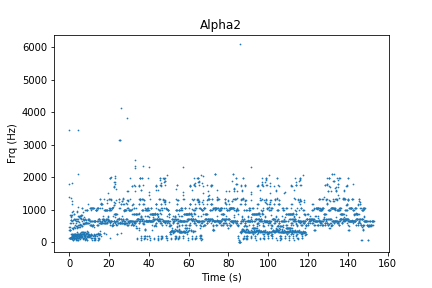

# Sadzam

A slow version of the Shazam algorithm implemented in Python.

## Why

This algorithm is extremely elegant in my opinion. 
It starts with the simple question "How do you search audio?"
But it must also handle noise, use a short sample, and be lightning fast.

The algorithm solves these through filtering, windowing, and FFTs to generate an audio fingerprint.

Importantly, it doesn't use neural nets or "machine learning".

### Algorithm

1. Read in audio file
2. Convert from stereo to mono
3. Low pass filter (butterworth)
4. Downsample
5. Hamming window in 0.1s intervals 
6. FFT and sort into (logarithmic) bins 
7. Save "loudest" frequencies into spectrogram
8. Create ordering of points **[IN PROGRESS]**
9. For each "target" point, calc distance from neighboring cluster
10. Save as keys in dict pointing to songID

## Considerations

5. Use whatever window besides rectangular to prevent spectral leakage
6. The frequency response of the human ear is highest at 3000Hz.
We split it up into 6 different frequency bins
7. We take the magnitude of the frequency
9. Complexity cannot scale up with size of database. You can't just do cross correlation

## Visualization

## Running the tests

pytest

## Acknowledgments

* https://www.ee.columbia.edu/~dpwe/papers/Wang03-shazam.pdf
* http://coding-geek.com/how-shazam-works/
* 3b1b's video on fourier transform
* Lots and lots of wikipedia
  * https://en.wikipedia.org/wiki/Short-time_Fourier_transform
